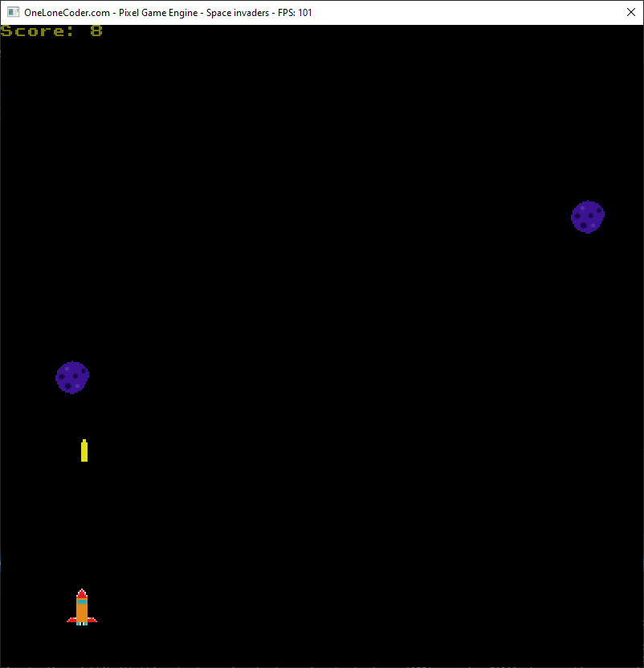

# space-invaders
Legendary game written using C++ and olcPixelGameEngine. Shoutout to javidx9.
## Controls and rules

<kbd>&leftarrow;</kbd> or <kbd>A</kbd> to go left

<kbd>&rightarrow;</kbd> or <kbd>D</kbd> to go right

<kbd>Space</kbd> to shoot

<kbd>Enter</kbd> to start a new game when 'Game over!' is displayed

### Prizes

    a prize which grants you 3x the speed

 a prize which grants you indestructability(collision with meteor doesn't mean game over)

      a prize which which makes each point count as 2

**Remark: Each prize lasts for 5 seconds.**

### Other objects

   an obstacle which you either avoid or destroy and win a point

  you

  bullet that you fire

**Another remark: all icons are custom designed(by me) because of copyrights, so do not be surprised by their appearance.**
