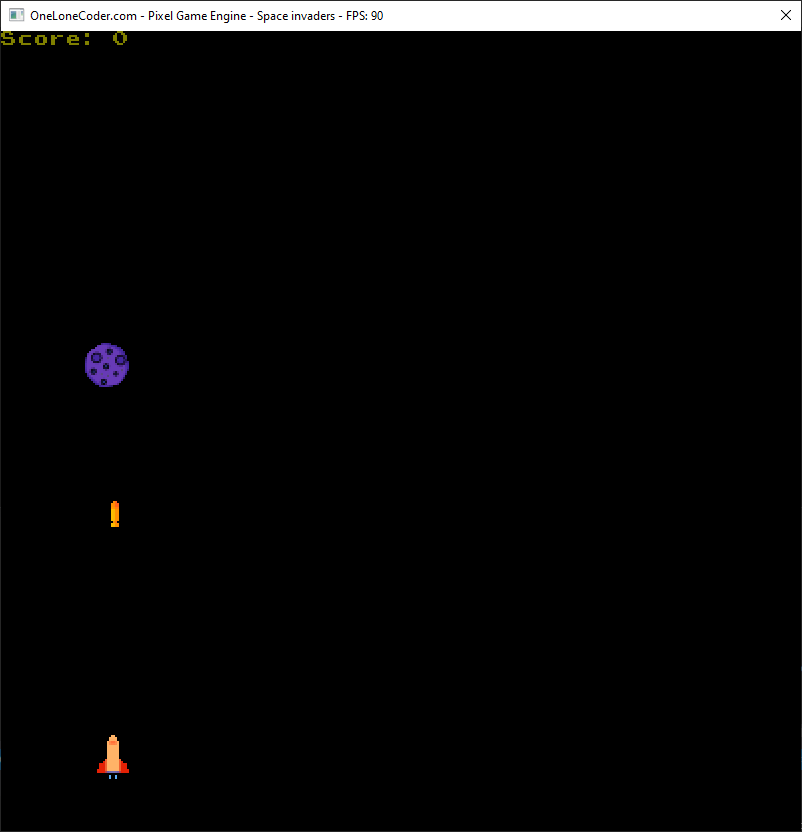

# space-invaders
Legendary game written using C++ and olcPixelGameEngine. Shoutout to javidx9.
## Controls and rules
You can move left using left arrow key or A, and you can move right using right arrow key or D.
With space you shoot. If you collide with any of the obstacles, game over.
                                  
   an obstacle which you either avoid or destroy and win a point

    a prize which grants you 3x the speed for 3 seconds

 a prize which grants you indestructability(collision with meteor doesn't mean game over) for 3 seconds

      a prize which which lasts for 3 seconds and makes each point count as 2

