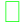
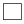
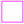
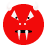
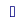
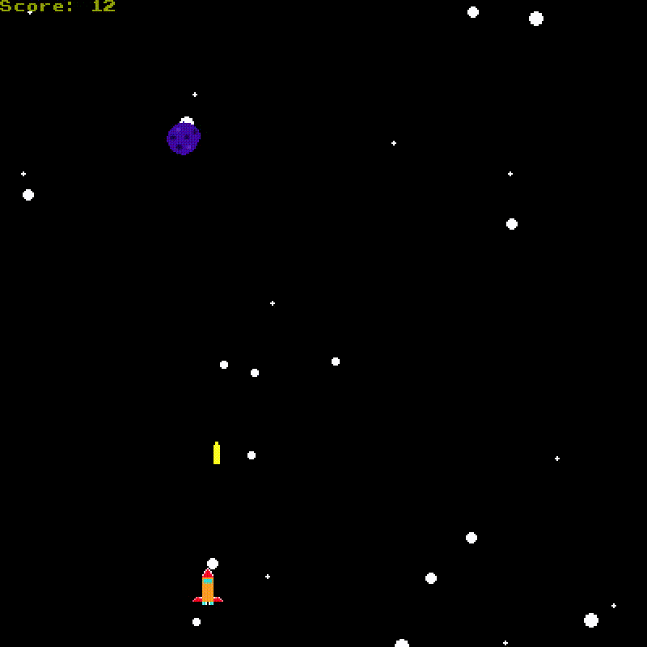
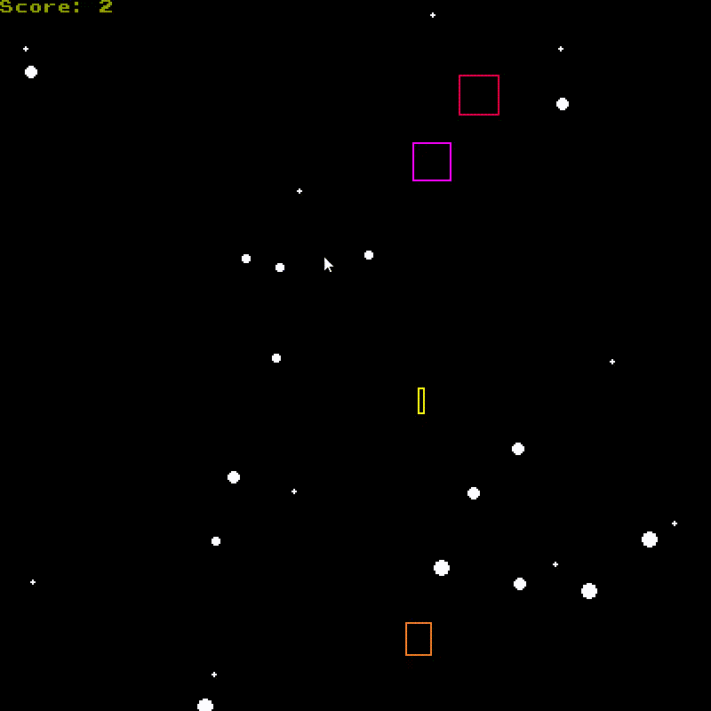

# space-invaders
Legendary game written using C++ and olcPixelGameEngine. Shoutout to javidx9.
## Controls and rules

<kbd>&leftarrow;</kbd> or <kbd>A</kbd> to go left

<kbd>&rightarrow;</kbd> or <kbd>D</kbd> to go right

<kbd>Space</kbd> to shoot

<kbd>Enter</kbd> to start a new game when 'Game over!' is displayed

<kbd>Esc</kbd> to pause the game

### Prizes
| Animated                               | Non-animated                                   | Effect                                |
| ---------------------------------------|:----------------------------------------------:| -------------------------------------:|
|       |    | Grants you 3x the speed               |
|     | | Meteor crash doesn't mean game over   |
|          |   | Each point counts as two              |
    

### Other objects
| Animated                               | Non-animated                                      | Description                           |
| ---------------------------------------|:-------------------------------------------------:| -------------------------------------:|
|      |      | An obstacle which you either avoid or destroy and win a point              |
|   |        | Your ship                             |
|      |      | Bullet that you fire                  |
|         |        | Boss which appears every 10 points    |
|  | | Projectile that boss fires            |

## Gameplay gifs

**If you change macro ANIMATED from 1 to 0, gameplay looks like this:**

## Additional information
* All icons are custom designed(by me) because of copyrights, so do not be surprised by their appearance.
* Exe file included in this project is the non-animated version.
* Each prize lasts for 5 seconds.
